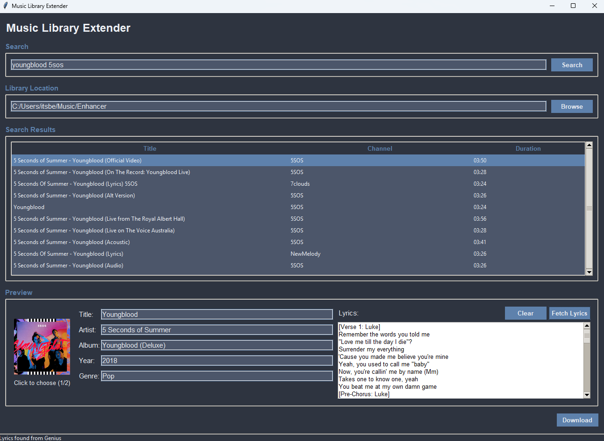

# Music Library Extender

A powerful desktop application for easily downloading music from YouTube with automatically fetched metadata, cover art, and lyrics.



## About

Music Library Extender is designed to be a quick and simple way to add high-quality music to your local library with all metadata properly attached. It automates the often tedious process of downloading songs, finding cover art, and adding proper ID3 tags.

## Features

- **YouTube Search**: Search for music directly from the application
- **Automatic Metadata**: Fetches song information from multiple sources including MusicBrainz and iTunes
- **Cover Art Selection**: Multiple cover art options from different sources with preview
- **Lyrics Integration**: Automatically finds and adds lyrics from sources like Genius, Happi API, Musixmatch, and Lyrics.ovh
- **Customizable Tags**: Edit title, artist, album, year, genre, and lyrics before downloading
- **Configurable Output**: Choose where to save your music files
- **High Quality Audio**: Downloads the best available audio quality and converts to MP3

## How it Works

1. **Search** for the song you want to add to your library
2. **Select** the correct video from the search results
3. **Review & Edit** the metadata (the app will try to fetch it automatically)
4. **Fetch Lyrics** with a single click (optional)
5. **Download** the song with all metadata attached

## Installation

### Prerequisites
- Python 3.6 or higher
- FFmpeg (required for audio conversion)

### Method 1: Using the Executable (Windows only)
1. Download the latest release from the Releases page
2. Run the executable file

### Method 2: From Source
1. Clone this repository:
```
git clone https://github.com/TheBeaconCrafter/MusicLibraryExtender.git
```

2. Install the required packages:
```
pip install -r requirements.txt
```

3. Run the application:
```
python app.py
```

## Usage

1. **Set your library location** where files will be saved
2. **Search for music** using the search bar
3. **Select a track** from the search results
4. The app will automatically try to **fetch metadata** including:
   - Title and artist (extracted from video title)
   - Album information
   - Year of release
   - Genre
   - Cover artwork
   - Lyrics
5. **Edit any metadata** if needed
6. Click **Download** to save the file with all metadata to your library

## Dependencies

- yt-dlp: YouTube downloading functionality
- requests: For API calls
- Pillow: Image processing for cover art
- mutagen: Managing ID3 tags
- musicbrainzngs: MusicBrainz API integration
- tkinter: GUI framework

## Building from Source

To create a standalone executable:

```
pyinstaller --onefile --noconsole --icon=resources/icon.ico app.py
```

## License

This project is licensed under the MIT License - see the LICENSE file for details.